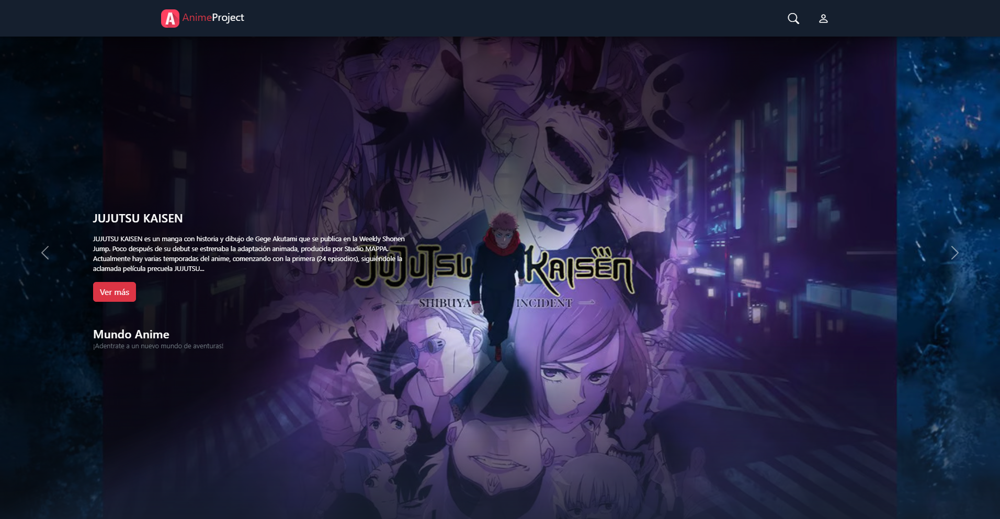

# Anime Project

Plataforma web full-stack orientada a la comunidad, donde los usuarios pueden explorar un catálogo de animes, interactuar mediante comentarios, gestionar favoritos y personalizar su perfil.  
El proyecto fue desarrollado como parte del curso **Initial Web Developer**, representando mi primer acercamiento a una aplicación web con backend y base de datos real.

**Sitio web en producción:**  
https://anime-project.alwaysdata.net/

---

## Descripción General

Anime Project es una aplicación web clásica basada en servidor (no SPA), desarrollada con **Node.js y Express**, que renderiza vistas dinámicas utilizando **Handlebars** y persiste los datos en una base de datos **MySQL**.

La plataforma simula un sitio de reseñas y comunidad, permitiendo a los usuarios registrados interactuar con el contenido y entre ellos, mientras que un usuario administrador puede moderar y gestionar la información del sistema.

---

## Funcionalidades Principales

### Usuarios

- Registro e inicio de sesión
- Selección de imagen de perfil
- Gestión de animes favoritos
- Publicación de comentarios
- Respuesta a comentarios
- Visualización de valoraciones de cada anime

### Catálogo de Animes

- Listado dinámico desde base de datos
- Vista detallada por anime con:
  - Descripción
  - Géneros
  - Cantidad de episodios
  - Trailer
  - Valoración de usuarios
  - Sección de comentarios

### Administración

- Alta y edición de animes
- Eliminación de comentarios
- Gestión de usuarios
- Moderación del contenido

---

## Tecnologías Utilizadas

- **Frontend**

  - HTML
  - CSS
  - JavaScript
  - Handlebars

- **Backend**

  - Node.js
  - Express

- **Base de Datos**

  - MySQL

- **Infraestructura**
  - Hosting en AlwaysData
  - Despliegue mediante SSH

---

## Capturas de Pantalla

### Página principal



_(El repositorio incluye imágenes adicionales de las distintas secciones del sitio)_

---

## Aprendizajes Destacados

- Primer proyecto web con **persistencia real de datos** utilizando MySQL
- Diseño y consultas sobre una **base de datos relacional**
- Implementación de autenticación, sesiones y roles
- Renderizado dinámico del contenido con Handlebars
- Separación básica de responsabilidades (rutas, lógica y vistas)
- Despliegue de una aplicación web en un servidor real utilizando **SSH**
- Manejo de permisos y moderación de contenido

---

## Configuración del Proyecto (Entorno Local)

### Requisitos

- Node.js
- MySQL
- npm

### Pasos para ejecutar el proyecto

1. Clonar el repositorio
   ```bash
   git clone https://github.com/EzequielMelo/CodoACodo_Anime-Page.git
   ```
2. Instalar dependencias
   ```bash
   npm install
   ```
3. Configurar la conexión a MySQL
   ```bash
   Editar los datos de conexión en el archivo correspondiente (host, usuario, contraseña y base de datos)
   ```
4. Iniciar el servidor
   ```bash
   nodemon app.js
   ```
5. Acceder desde el navegador
   ```bash
   http://localhost:PORT
   ```
