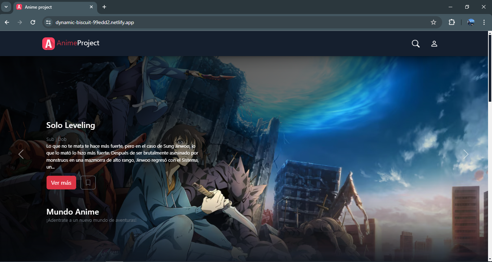

<h1>Anime Page</h1>

Sitio web: <a href="https://dynamic-biscuit-99edd2.netlify.app/">https://dynamic-biscuit-99edd2.netlify.app/</a>

<h3>Página principal</h3>

### Pasos a seguir para la conexión a MySQL

1- Descargamos packege.json: `npm init` 
2- Descargamos node_modules: `npm i mysql` 
3- Iniciamos la Base de datos: `nodemon app.js` 
4- Modificar la connection en caso de ser necesario 
